# StructBioReasoner

**An agentic framework for autonomous computational protein design using LLM-driven decision-making, distributed HPC execution, and structured scientific workflows.**

[](https://www.python.org/downloads/)
[](https://opensource.org/licenses/MIT)

## Overview

StructBioReasoner is a hierarchical multi-agent system that autonomously coordinates computational protein engineering workflows. An LLM-based reasoner decides **what** to do next and **how** to configure each step, while specialized agents execute folding, molecular dynamics, free energy calculations, and binder design on HPC resources via Parsl and Globus Compute.

The system follows a three-tier architecture:

- **Executive** -- manages the experiment, launches and monitors multiple Director agents
- **Director** -- runs an autonomous decide-then-execute loop, using an LLM to select and parameterize each task
- **Worker Agents** -- execute scientific computations (folding, MD, design, analysis, free energy)

All decisions, plans, and scientific results are persisted to a database through a dedicated Data Agent, enabling full audit trails and cross-director analytics.

## Architecture

```mermaid
%%{init: {'theme': 'base', 'themeVariables': {'primaryColor': '#1a1a2e', 'primaryTextColor': '#eee', 'primaryBorderColor': '#6c63ff', 'lineColor': '#6c63ff', 'secondaryColor': '#16213e', 'tertiaryColor': '#0f3460', 'edgeLabelBackground': '#1a1a2e'}}}%%

graph TD
    subgraph Executive["Executive Agent (simple_executive.py)"]
        EX_INIT["initialize()<br/>Create Manager + Globus Compute"]
        EX_LOOP["perform_experiment()<br/>Main management loop"]
        EX_MANAGE["manage_directors()<br/>Monitor & control directors"]
        EX_EVAL["evaluate_director()<br/>Check status via ReasonerAgent"]
        EX_DECIDE{{"KILL | ADVISE | CONTINUE"}}
        EX_SUMMARY["summarize_experiment()<br/>Collect final results"]

        EX_INIT --> EX_LOOP --> EX_MANAGE --> EX_EVAL --> EX_DECIDE
        EX_DECIDE -->|loop| EX_MANAGE
        EX_LOOP --> EX_SUMMARY
    end

    subgraph Director1["Director Agent 1 (director_agent.py)"]
        D1_LOOP["agentic_run()<br/>Main decision-execution loop"]

        subgraph Reasoning["Step 1: query_reasoner()"]
            REC["ReasonerAgent.generate_recommendation()<br/>LLM Call &rarr; WHAT to do next"]
            PLAN["ReasonerAgent.plan_run()<br/>LLM Call &rarr; HOW to do it"]
            REC --> PLAN
        end

        subgraph ToolCall["Step 2: tool_call(task, plan)"]
            RESOLVE["Resolve TaskName &rarr; Agent Key"]
            DISPATCH["agent.run(**config)"]
            RESOLVE --> DISPATCH
        end

        D1_LOOP --> Reasoning --> ToolCall
        ToolCall -->|loop| D1_LOOP
    end

    subgraph Director2["Director Agent N (parallel instances)"]
        D2_LOOP["agentic_run()<br/>Independent experiment branch"]
    end

    subgraph Agents["Specialized Worker Agents"]
        subgraph Design["Computational Design"]
            BC["BindCraftCoordinator<br/>(bindcraft_coordinator.py)"]
            BC_FOLD["prepare_run() &rarr; Chai folding"]
            BC_INV["inverse_fold_sequences() &rarr; ProteinMPNN"]
            BC_QC["run_qc() &rarr; SequenceQualityControl"]
            BC_EN["compute_energy() &rarr; SimpleEnergy"]
            BC --> BC_FOLD & BC_INV & BC_QC & BC_EN
        end

        subgraph Folding["Structure Prediction"]
            CHAI["ChaiAgent<br/>(chai_agent.py)"]
            CHAI_RUN["run() &rarr; fold_sequence_task()<br/>Chai-1 folding"]
            CHAI --> CHAI_RUN
        end

        subgraph MD["Molecular Dynamics"]
            MDA["MDAgent<br/>(MD.py)"]
            MD_BUILD["build_system() &rarr; Amber prep"]
            MD_SIM["run_simulation() &rarr; Production MD"]
            MDA --> MD_BUILD --> MD_SIM
        end

        subgraph FE["Free Energy"]
            FEA["FEAgent<br/>(mmpbsa_agent.py)"]
            FE_RUN["run() &rarr; MM-PBSA calculation"]
            FEA --> FE_RUN
        end

        subgraph Analysis["Trajectory Analysis"]
            TA["TrajectoryAnalysisAgent<br/>(trajectory_analysis.py)"]
            TA_RUN["RMSD / RMSF / Contacts / Hotspots"]
            TA --> TA_RUN
        end

        subgraph LM["Language Model"]
            RA["ReasonerAgent<br/>(pydantic_ai_agent.py)"]
            RA_REC["generate_recommendation()"]
            RA_PLAN["plan_run()"]
            RA_QUERY["query() / evaluate_history()"]
            RA --> RA_REC & RA_PLAN & RA_QUERY
        end

        subgraph RAG_Agent["Literature Retrieval"]
            RAG["RAGAgent<br/>(rag_agent.py)"]
            RAG_RUN["HiPerRAG pipeline"]
            RAG --> RAG_RUN
        end
    end

    subgraph Data["Data Layer"]
        DA["DataAgent<br/>(data_agent.py)"]
        DA_WRITE["record_event() / record_scientific_event()<br/>Batched writes (50 events / 2s)"]
        DA_READ["get_director_history()<br/>get_experiment_summary()<br/>get_top_binders()<br/>get_sequence_lifecycle()"]
        DA --> DA_WRITE & DA_READ
        DB[("Database<br/>PostgreSQL / SQLite")]
        DA_WRITE --> DB
        DA_READ --> DB
    end

    subgraph Compute["HPC / Distributed Compute"]
        PARSL["Parsl Task Execution"]
        GC["Globus Compute Endpoint"]
    end

    %% Executive to Directors
    EX_INIT -->|"launch via Academy Manager"| D1_LOOP
    EX_INIT -->|"launch via Academy Manager"| D2_LOOP
    EX_DECIDE -->|"KILL"| D1_LOOP
    EX_DECIDE -->|"ADVISE (send instructions)"| D1_LOOP
    EX_EVAL -->|"query history"| DA_READ

    %% Director to Agents (tool calls)
    DISPATCH -->|"computational_design"| BC
    DISPATCH -->|"structure_prediction"| CHAI
    DISPATCH -->|"molecular_dynamics"| MDA
    DISPATCH -->|"free_energy"| FEA
    DISPATCH -->|"analysis"| TA
    DISPATCH -->|"rag"| RAG

    %% Director to Reasoner
    REC -->|"LLM call"| RA_REC
    PLAN -->|"LLM call"| RA_PLAN
    EX_EVAL -->|"evaluate_history()"| RA_QUERY

    %% All agents emit events to DataAgent
    D1_LOOP -.->|"DECISION / PLAN / EXECUTION events"| DA_WRITE
    D2_LOOP -.->|"events"| DA_WRITE
    BC -.->|"SEQUENCE_GENERATED / QC_RESULT"| DA_WRITE
    CHAI -.->|"FOLDING_RESULT"| DA_WRITE
    MDA -.->|"SIMULATION_RUN"| DA_WRITE
    FEA -.->|"FREE_ENERGY_RESULT"| DA_WRITE
    TA -.->|"TRAJECTORY_ANALYSIS"| DA_WRITE

    %% Agents to Parsl
    BC_FOLD & BC_INV & BC_QC & BC_EN -->|"Parsl apps"| PARSL
    CHAI_RUN -->|"Parsl apps"| PARSL
    MD_BUILD & MD_SIM -->|"Parsl apps"| PARSL
    FE_RUN -->|"Parsl apps"| PARSL
    TA_RUN -->|"Parsl apps"| PARSL
    PARSL --- GC

    %% Styling
    classDef executive fill:#6c63ff,stroke:#6c63ff,color:#fff
    classDef director fill:#e94560,stroke:#e94560,color:#fff
    classDef agent fill:#0f3460,stroke:#6c63ff,color:#eee
    classDef data fill:#16213e,stroke:#00b4d8,color:#eee
    classDef compute fill:#1b4332,stroke:#52b788,color:#eee
    classDef decision fill:#ff6b6b,stroke:#ff6b6b,color:#fff

    class EX_INIT,EX_LOOP,EX_MANAGE,EX_EVAL,EX_SUMMARY executive
    class D1_LOOP,D2_LOOP director
    class EX_DECIDE decision
    class BC,CHAI,MDA,FEA,TA,RA,RAG agent
    class DA,DB data
    class PARSL,GC compute
```



## How It Works

### 1. Executive Agent (`agents/executive/simple_executive.py`)

The top-level orchestrator. It initializes an Academy Manager with a Globus Compute endpoint, launches one or more Director agents, and runs a management loop that periodically evaluates each director's progress. Based on the evaluation it can:

- **CONTINUE** -- let the director keep running
- **ADVISE** -- send new instructions or constraints to the director
- **KILL** -- terminate an underperforming director and optionally launch a replacement

At the end of the experiment it collects and summarizes results across all directors.

### 2. Director Agent (`agents/director/director_agent.py`)

Each Director runs an autonomous `agentic_run()` loop with two phases per iteration:

1. **query_reasoner()** -- Two-stage LLM call via the ReasonerAgent:
   - `generate_recommendation()` -- decides the next task (returns a `Recommendation` with `next_task`, `change_parameters`, `rationale`)
   - `plan_run()` -- produces a task-specific configuration (e.g., `ComputationalDesignConfig`, `MolecularDynamicsConfig`)

2. **tool_call(task, plan)** -- resolves the task name to an agent key and calls `agent.run(**config)`:

   | Task Name | Agent Key | Agent Class |
   |-----------|-----------|-------------|
   | `COMPUTATIONAL_DESIGN` | `bindcraft` | BindCraftCoordinator |
   | `STRUCTURE_PREDICTION` | `folding` | ChaiAgent |
   | `MOLECULAR_DYNAMICS` | `md` | MDAgent |
   | `FREE_ENERGY` | `mmpbsa` | FEAgent |
   | `ANALYSIS` | `reasoner` | TrajectoryAnalysisAgent |
   | `RAG` | `reasoner` | RAGAgent |

The loop repeats until the LLM returns a `STOP` signal or the executive terminates the director.

### 3. Worker Agents

Each worker agent inherits from `academy.Agent` and submits compute-heavy work as Parsl apps:

- **BindCraftCoordinator** (`agents/computational_design/`) -- Orchestrates the binder design pipeline: initial folding via Chai, inverse folding via ProteinMPNN, sequence quality control (diversity, charge, hydrophobic ratio), and binding energy calculation.

- **ChaiAgent** (`agents/structure_prediction/`) -- Runs Chai-1 structure prediction on input sequences with optional constraints.

- **MDAgent** (`agents/molecular_dynamics/`) -- Builds Amber systems (`parsl_build`) and runs production molecular dynamics simulations (`parsl_simulate`).

- **FEAgent** (`agents/molecular_dynamics/mmpbsa_agent.py`) -- Computes binding free energies using MM-PBSA on simulation trajectories.

- **TrajectoryAnalysisAgent** (`agents/analysis/`) -- Analyzes MD trajectories: RMSD, RMSF, radius of gyration, contact frequency, and hotspot identification.

- **RAGAgent** (`agents/hiper_rag/`) -- Literature retrieval and knowledge mining via the HiPerRAG pipeline.

### 4. ReasonerAgent (`agents/language_model/pydantic_ai_agent.py`)

The LLM interface used by both the Director (for task decisions) and the Executive (for director evaluation). Built on pydantic-ai, it returns structured Pydantic models and supports OpenAI-compatible endpoints with ALCF Globus token authentication.

### 5. DataAgent (`agents/data/data_agent.py`)

Handles all persistence. Buffers workflow events (`LLM_CALL`, `DECISION`, `PLAN`, `EXECUTION_START/END`) and scientific events (`SEQUENCE_GENERATED`, `FOLDING_RESULT`, `SIMULATION_RUN`, `FREE_ENERGY_RESULT`, etc.) with automatic batch flushing (every 50 events or 2 seconds). Provides read queries for the Executive: director history, experiment summaries, top binders, sequence lifecycles, and cross-director analytics. Backed by SQLAlchemy with PostgreSQL (asyncpg) or SQLite (aiosqlite).

## Project Structure

```
StructBioReasoner/
├── struct_bio_reasoner/
│   ├── models.py                    # TaskName enum, config models, Recommendation schema
│   ├── agents/
│   │   ├── executive/               # Executive agent (simple_executive.py)
│   │   ├── director/                # Director agent (director_agent.py)
│   │   ├── language_model/          # ReasonerAgent (pydantic_ai_agent.py)
│   │   ├── computational_design/    # BindCraftCoordinator
│   │   ├── structure_prediction/    # ChaiAgent
│   │   ├── molecular_dynamics/      # MDAgent, FEAgent
│   │   ├── analysis/                # TrajectoryAnalysisAgent
│   │   ├── hiper_rag/               # RAGAgent
│   │   ├── data/                    # DataAgent, event models, DB schema
│   │   └── embedding/               # ESM/GenSLM embedding and diversity sampling
│   ├── prompts/
│   │   ├── _registry.py             # Auto-discovery prompt registry
│   │   ├── _recommender.py          # Recommendation prompt builder
│   │   └── tasks/                   # Per-task prompt templates
│   │       ├── computational_design.py
│   │       ├── molecular_dynamics.py
│   │       ├── structure_prediction.py
│   │       ├── analysis.py
│   │       ├── free_energy.py
│   │       └── rag.py
│   └── utils/
├── config/                          # YAML configuration files
├── examples/                        # Example scripts and demos
├── tests/                           # Test suite
├── scripts/                         # Utility and HPC submission scripts
├── docs/                            # Additional documentation
├── pyproject.toml
└── requirements.txt
```

## Installation

```bash
git clone <repository-url>
cd StructBioReasoner
pip install -e .
```

For development dependencies:

```bash
pip install -e ".[dev]"
```

### Environment Setup

```bash
cp .env.example .env
```

Configure the following in `.env`:

| Variable | Required | Description |
|----------|----------|-------------|
| `OPENAI_API_KEY` | Yes | LLM API key (OpenAI-compatible endpoint) |
| `ANTHROPIC_API_KEY` | No | Alternative LLM provider |
| `LOG_LEVEL` | No | Logging verbosity (default: INFO) |

### Requirements

- Python >= 3.10
- Core: `pydantic`, `pydantic-ai`, `httpx`, `sqlalchemy[asyncio]`, `asyncpg`
- HPC: Parsl, Globus Compute, Academy framework
- Science: Amber/AmberTools (MD), Chai-1 (folding), ProteinMPNN (inverse folding)

## Configuration

Experiments are configured via YAML. The config has two main sections:

- **`executive`** -- model, temperature, check interval, max directors
- **`director`** -- enabled agents, research goal, target protein, resource allocation

See `config/hierarchical_workflow_config.yaml` for a full example.

## Task Types

The `TaskName` enum defines the available workflow steps:

| Task | Description |
|------|-------------|
| `COMPUTATIONAL_DESIGN` | Binder design: folding, inverse folding, QC, energy |
| `STRUCTURE_PREDICTION` | Protein structure prediction via Chai-1 |
| `MOLECULAR_DYNAMICS` | System building and production MD simulation |
| `FREE_ENERGY` | MM-PBSA binding free energy calculation |
| `ANALYSIS` | Trajectory analysis (RMSD, RMSF, contacts, hotspots) |
| `RAG` | Literature retrieval via HiPerRAG |
| `STARTING` | Bootstrap task (workflow initialization) |
| `STOP` | Terminal signal (end the director loop) |

## Event System

All workflow activity is captured as structured events for observability and reproducibility:

**Workflow events:** `LLM_CALL`, `DECISION`, `PLAN`, `EXECUTION_START`, `EXECUTION_END`, `KEY_ITEM`, `EXECUTIVE_ACTION`, `EXPERIMENT_START/END`, `DIRECTOR_START/END`

**Scientific events:** `SEQUENCE_GENERATED`, `QC_RESULT`, `FOLDING_RESULT`, `ENERGY_RESULT`, `SIMULATION_RUN`, `TRAJECTORY_ANALYSIS`, `FREE_ENERGY_RESULT`, `EMBEDDING`

## Authors

- Matt Sinclair (msinclair@anl.gov)
- Archit Vasan

## License

MIT -- see [LICENSE](LICENSE) for details.
